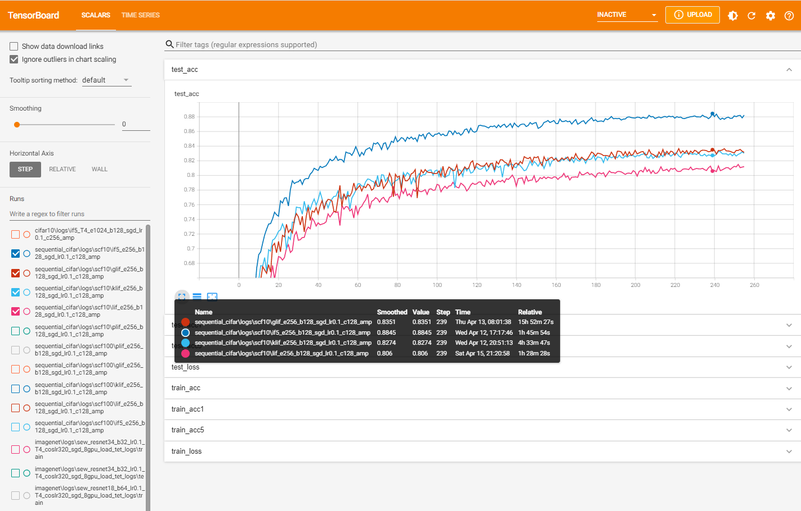

## Parallel Spiking Neuron

This repo contains source codes for the NeurIPS 2023 paper [Parallel Spiking Neurons with High Efficiency and Ability to Learn Long-term Dependencies
]([https://arxiv.org/abs/2304.12760](https://openreview.net/forum?id=rfTFJvTkr2)). Model weights on the CIFAR10, CIFAR10-DVS and ImageNet datasets are available at https://figshare.com/articles/dataset/Checkpoints_for_Parallel-Spiking-Neuron/24454912 .

The source codes of the PSN family have been pushed in SpikingJelly (the master version in GitHub) and can be used easily. It is highly recommended to try the PSN family in your SNNs.


The source codes for different datasets are stored in the corresponding directories, and the tensorboard logs are stored in the subdirectories. For example, the source codes for the CIFAR10 dataset are located in `./cifar10`, and the tensorboard logs are located in `./cifar10/logs`. Args are also stored in `args.txt` with the tensorboard logs.

SpikingJelly is required to run these codes. The version of SpikingJelly should be `>=0.0.0.0.14 ` unless otherwise specified.

Install the SpikingJelly with the version `0.0.0.0.14`:

```
pip install spikingjelly==0.0.0.0.14
```

To check the training logs, the tensorboard is required.

Install the tensorboard if needed:

```
pip install tensorboard
```

Launch the tensorboard:

```
tensorboard.exe --logdir=./
```

Open http://localhost:6006/  and check the logs:




For usage of codes, refer to the `readme` in each directory.

Note that the released codes are simplified codes with removing some primitive modules.


## Usage in SpikingJelly

Refer to the following links for API docs:

https://spikingjelly.readthedocs.io/zh_CN/latest/sub_module/spikingjelly.activation_based.neuron.html#spikingjelly.activation_based.neuron.PSN

https://spikingjelly.readthedocs.io/zh_CN/latest/sub_module/spikingjelly.activation_based.neuron.html#spikingjelly.activation_based.neuron.MaskedPSN

https://spikingjelly.readthedocs.io/zh_CN/latest/sub_module/spikingjelly.activation_based.neuron.html#spikingjelly.activation_based.neuron.SlidingPSN

Firstly, install the master version of SpikingJelly. Do not install from pypi because only the stable versions will be released to pypi.

```bash
git clone https://github.com/fangwei123456/spikingjelly.git
cd spikingjelly
python setup.py install
```

Then, import the PSN family and use them.

The example of `PSN`:

```python
import torch
from spikingjelly.activation_based import neuron

T = 4
N = 2
psn = neuron.PSN(T=T)
x_seq = torch.rand([T, N]) + 2.
y_seq = psn(x_seq)
print(y_seq)
'''
tensor([[0., 0.],
        [1., 1.],
        [0., 0.],
        [0., 0.]], grad_fn=<ViewBackward0>)
'''
```

The example of `MaskedPSN`:

```python
import torch
from spikingjelly.activation_based import neuron

T = 4
N = 2
masked_psn = neuron.MaskedPSN(k=2, T=T)
epochs = 4
for epoch in range(epochs):
    masked_psn.lambda_ = (epoch + 1) / epochs
    print(f'epoch={epoch}, weight = ')
    with torch.no_grad():
        print(masked_psn.masked_weight())
'''
epoch=0, weight = 
tensor([[ 0.1137, -0.2760, -0.1344,  0.3556],
        [ 0.0724,  0.4752,  0.1168, -0.1484],
        [-0.1385, -0.3990,  0.4036,  0.2598],
        [ 0.2951,  0.2952, -0.1521,  0.0234]])
epoch=1, weight = 
tensor([[ 0.1137, -0.1840, -0.0896,  0.2371],
        [ 0.0724,  0.4752,  0.0779, -0.0990],
        [-0.0924, -0.3990,  0.4036,  0.1732],
        [ 0.1968,  0.1968, -0.1521,  0.0234]])
epoch=2, weight = 
tensor([[ 0.1137, -0.0920, -0.0448,  0.1185],
        [ 0.0724,  0.4752,  0.0389, -0.0495],
        [-0.0462, -0.3990,  0.4036,  0.0866],
        [ 0.0984,  0.0984, -0.1521,  0.0234]])
epoch=3, weight = 
tensor([[ 0.1137, -0.0000, -0.0000,  0.0000],
        [ 0.0724,  0.4752,  0.0000, -0.0000],
        [-0.0000, -0.3990,  0.4036,  0.0000],
        [ 0.0000,  0.0000, -0.1521,  0.0234]])
'''
```

```python
import torch
from spikingjelly.activation_based import neuron, functional

T = 64
N = 64
masked_psn = neuron.MaskedPSN(lambda_init=1., k=32, T=T, step_mode='m')
x_seq = torch.rand([T, N]) + 2.
y_seq_m = masked_psn(x_seq)
masked_psn.step_mode = 's'
y_seq_s = functional.multi_step_forward(x_seq, masked_psn)
print('firing rate = ', y_seq_m.mean())
print('The error of two step modes is', (y_seq_m - y_seq_s).abs().sum())
'''
firing rate =  tensor(0.1467, grad_fn=<MeanBackward0>)
The error of two step modes is tensor(0., grad_fn=<SumBackward0>)
'''
```

The example of `SlidingPSN`:

```python
import torch
from spikingjelly.activation_based import neuron

T = 64
N = 64
spsn = neuron.SlidingPSN(k=2, step_mode='m', backend='gemm')
x_seq = torch.rand([T, N])
y_seq_gemm = spsn(x_seq)
spsn.backend = 'conv'
y_seq_conv = spsn(x_seq)
print('firing rate = ', y_seq_gemm.mean())
print('The error of two backends is', (y_seq_gemm - y_seq_conv).abs().sum())
'''
firing rate =  tensor(0.2275, grad_fn=<MeanBackward0>)
The error of two backends is tensor(0., grad_fn=<SumBackward0>)
'''
```

```python
import torch
from spikingjelly.activation_based import neuron, functional

T = 64
N = 64
spsn = neuron.SlidingPSN(k=2, step_mode='m')
x_seq = torch.rand([T, N])
y_seq_m = spsn(x_seq)
spsn.step_mode = 's'
y_seq_s = functional.multi_step_forward(x_seq, spsn)
print('firing rate = ', y_seq_m.mean())
print('The error of two step modes is', (y_seq_m - y_seq_s).abs().sum())
'''
firing rate =  tensor(0.2327, grad_fn=<MeanBackward0>)
The error of two step modes is tensor(0., grad_fn=<SumBackward0>)
'''
```
